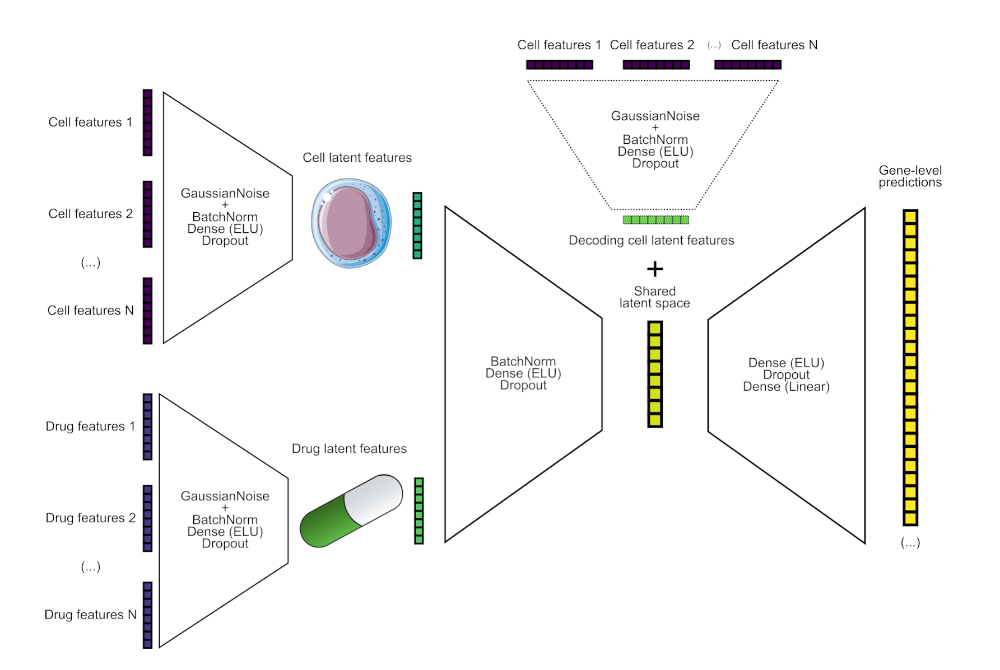
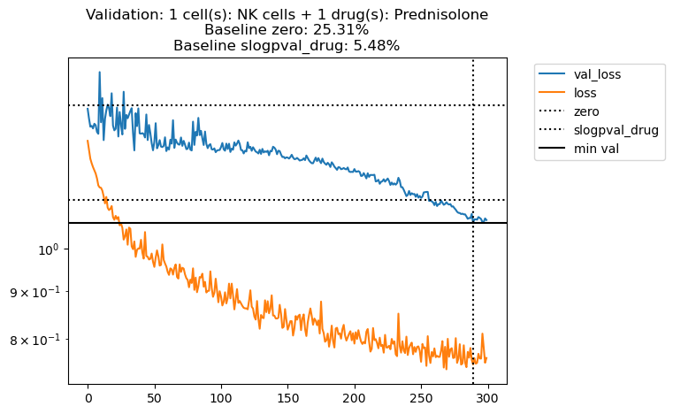

<p align="center">
<picture>
  
</picture>
<h1 align="center" margin=0px>
ScAPE: Single-cell Analysis of Perturbational Effects
</h1>
</p>

ScAPE is a package implementing the neural network model used in the _Open Problems – Single-Cell Perturbations challenge_ hosted by Kaggle. This is the model we used to generate the submission that achieved top <2% performance (16th position out of 1097 teams) in the [final leaderboard](https://www.kaggle.com/competitions/open-problems-single-cell-perturbations/leaderboard).

## Description

In this Kaggle competition, the main objective was to predict the effect of drug perturbations on peripheral blood mononuclear cells (PBMCs) from several patient samples.

Similar to most problems in biological research via omics data, we encountered a high-dimensional feature space (~18k genes) and a low-dimensional observation space (~614 cell/drug combinations) with a low signal-to-noise ratio, where most of the genes show random fluctuations after perturbation. The main data modality to be predicted consisted of signed and log-transformed P-values from differential expression (DE) analysis. In the DE analysis, pseudo-bulk expression profiles from drug-treated cells were compared against the profiles of cells treated with Dimethyl Sulfoxide (DMSO). 

<p align="center">
<picture>
  
</picture>
<p align="center" margin=0px>
Neural network architecture used for the challenge (ScAPE model).
</p>
</p>


We used a Neural Network that takes as inputs drug and cell features and produces signed log-pvalues. Features were computed as the median of the signed log-pvalues grouped by drugs and cells, calculated from the `de_train.parquet` file (on the training data). Additionally, we also estimated log fold-changes from pseudo bulk gene expression, to produce a matrix of the same shape as the de_train data but containing log fold changes (LFCs) on gene expression. We computed also the median per cell/drug as features for LFCs.

Similar to a Conditional Variational Autoencoder (CVAE), we used cell features both in the encoding part and the decoding part of the NN. Initially, the model consisted of a CVAE that was trained using the cell features as the conditional features to learn an encoding/decoding function conditioned on the particular cell type. However, after testing different ways to train the CVAE (similar to a beta-VAE with different annealing strategies for the Kullback-Leibler divergence term), we finally considered a non probabilistic NN since we did not find any practical advantage or better generalizations in this case with respect to a simpler non-probabilistic NN, much easier to train. 


## Install the package

```
pip install git+https://github.com/scapeML/scape.git
```

## Data

In addition to the data provided by the challenge, we estimated log fold changes from pseudobulk data that we used as additional features. All the data, including the files from the challenge, can be downloaded from the following link:

- https://e.pcloud.link/publink/show?code=XZAvz1ZtQRREhpX4KFIsMeurkJdYztbFPSX

## Usage


### Training

ScAPE can be used also as a command line tool. The following command can be used to train a model:

```
 python -m scape train --epochs <num-epochs> --n-genes <num-genes> --cv-cell <cell-type> --cv-drug <sm-name> --output-dir <directory> <de-file> <lfc-file>
```
For example, in order to leave Belinostat out as a drug for cross-validation (using NK cells by default), we can run the following command:
  
```
python -m scape train --n-genes 64 --cv-drug Belinostat --output-dir models de_train.parquet lfc_train.parquet
```


## Interpreting error plots

The method `scape.util.plot_result(result, legend=True)` can be used to plot the CV results after training a model, as shown in the [quick-start notebook](https://github.com/scapeML/scape/blob/main/docs/notebooks/quick-start.ipynb). The following figure shows an example of the output of this method:

<picture>
  
</picture>

The plot shows two different baselines. The top dotted line shows the performance of a model that always predicts 0s, as the one used as baseline in the Kaggle challenge. The bottom dotted line shows the performance of a model that always predicts the median of the training data (grouped by drug type). This baseline is useful to compare the performance of the model with a simple model that does not learn anything. The solid line indicates the best validation error.

The title of the plot indicates how much better the model is with respect to the baselines. The percentages are computed as follows:

```
improvement = 100 * (1 - (current / baseline_error))
```

For example, in the figure above, the trained model is 25.31% better than the baseline that always predicts 0s, and only 5.48% better than the baseline that always predicts the median of the signed log p-values across drugs in the training data.

## Notebooks

- Basic usage: https://github.com/scapeML/scape/blob/main/docs/notebooks/quick-start.ipynb
- Training pipeline: https://github.com/scapeML/scape/blob/main/docs/notebooks/solution.ipynb
- Performance with different top genes: https://github.com/scapeML/scape/blob/main/docs/notebooks/subset-genes.ipynb

## Final report

Prior to the refactor and creation of the ScAPE package, we used a simplified version of the model to explore different questions and to do hyperparameter tuning. The notebook used to generate the final report can be found in the following link:

- https://docs.google.com/document/d/1w0GIJ8VoQx3HEJNmLXoU-Y_STB-h5-bXusL80_6EVuU/edit?usp=sharing


## Reproducibility

The following notebook can be used to reproduce the results of our submission: https://github.com/scapeML/scape/blob/main/docs/notebooks/solution.ipynb.

In addition, we've created a [Google Colab](https://colab.research.google.com/drive/1-o_lT-ttoKS-nbozj2RQusGoi-vm0-XL?usp=sharing) notebook showing how to install, train and predict using the ScAPE package.
